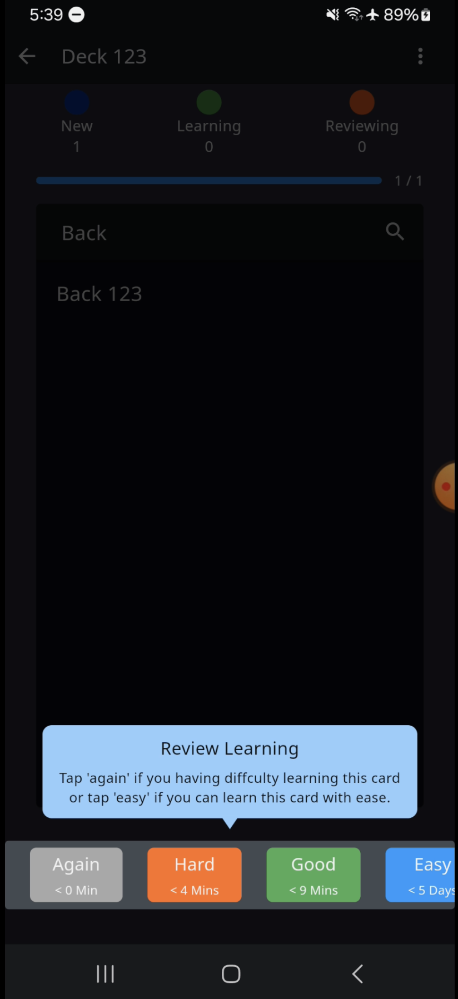
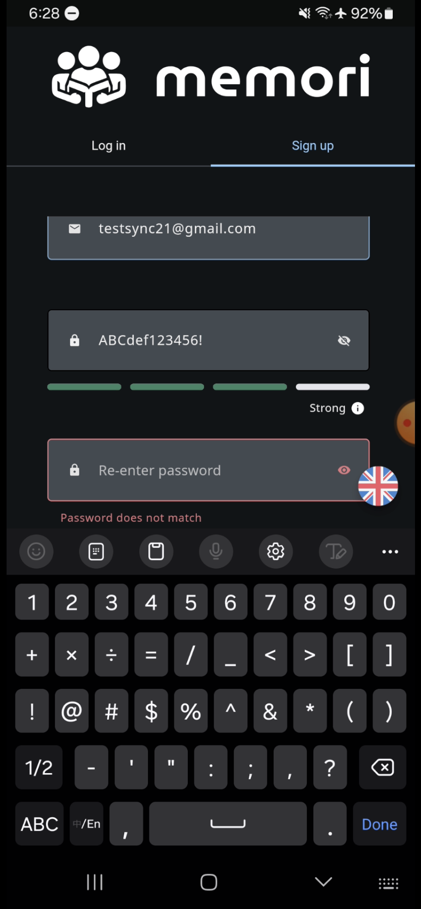
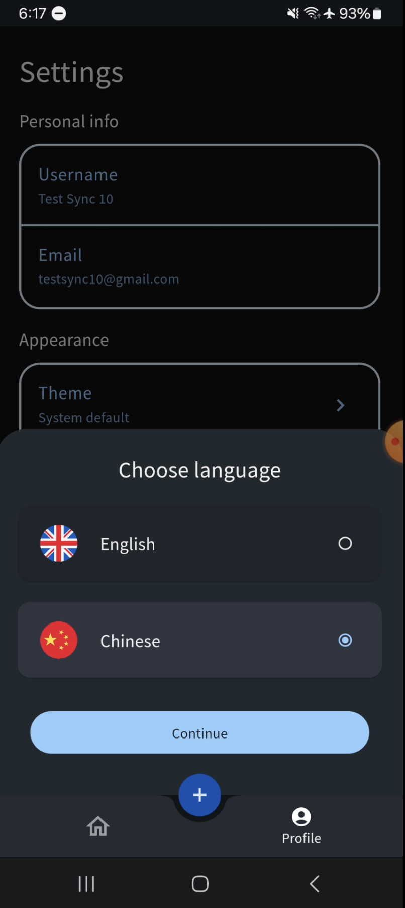
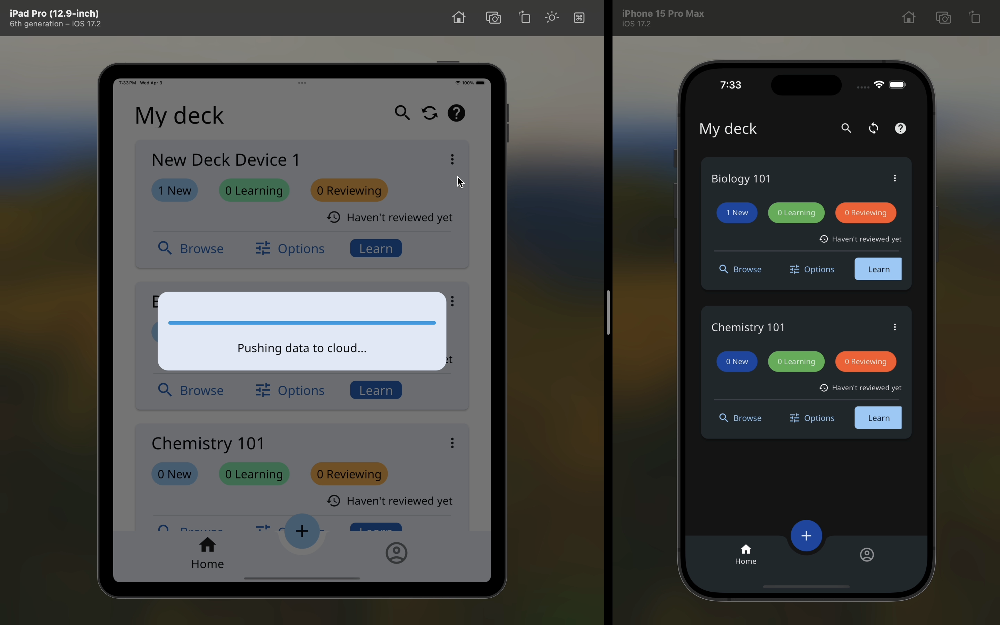

# Memori App

A flashcard learning app, made with Flutter.

## Table of Contents
- [Features](#features)
- [App Demo](#app-demo)
- [Dev Requirements](#dev-requirements)
- [Getting Started](#getting-started)
  - [Firebase](#firebase)
  - [IDE setup](#ide-setup)

## Features
1. **Flashcard Management**: Seamlessly create and edit flashcards, empowering users to personalize their learning experience.
2. **Advanced Learning System**: Engage with new and review existing flashcards, enhanced by a modern spaced repetition algorithm algorithm that optimizes the learning curve.
3. **Secure Account Management**: Offers a straightforward process for account deletion, ensuring user data privacy and control.
4. **Cross-Device Synchronization**: Synchronize your learning progress across multiple devices, providing a consistent and uninterrupted learning experience.
5. **Theme Customization**: Choose between light and dark themes to suit your visual preference, facilitating a comfortable reading environment day or night.
6. **Adjustable Text Size**: Customize the text size for optimal readability, accommodating individual visual requirements.
7. **Multilingual Support**: Access the application in multiple languages, making it accessible and user-friendly for a global audience.

## App Demo
1. Onboarding/UI guide on how to use the app [(Video link)](https://drive.google.com/file/d/17wFKBKYIcck9WRg62eoXiwz3YS51GEJx/view?usp=share_link)
<a href="https://drive.google.com/file/d/17wFKBKYIcck9WRg62eoXiwz3YS51GEJx/view?usp=share_link" target="_blank">
    
</a>

2. Sign up flow [(Video link)](https://drive.google.com/file/d/1Dw9zKJBnt4ms4d8hZy4crnEusO4UtCIJ/view?usp=share_link)
<a href="https://drive.google.com/file/d/1Dw9zKJBnt4ms4d8hZy4crnEusO4UtCIJ/view?usp=share_link" target="_blank">
    
</a>

3. Configurable theme, multiple languages, and text sizes [(Video link)](https://drive.google.com/file/d/1iVNnntJI5QEQ6h-3VM98qCjzCmmH5HrV/view?usp=share_link)
<a href="https://drive.google.com/file/d/1iVNnntJI5QEQ6h-3VM98qCjzCmmH5HrV/view?usp=share_link" target="_blank">
    
</a>

4. Sync across devices [(Video link)](https://drive.google.com/file/d/15-ZcUWn6dhJZ5zuLYywscuR8wa6Mfvl0/view?usp=share_link)
<a href="https://drive.google.com/file/d/15-ZcUWn6dhJZ5zuLYywscuR8wa6Mfvl0/view?usp=share_link" target="_blank">
    
</a>

## Dev Requirements
1. Flutter
2. Flutterfire CLI [(links)](https://firebase.google.com/docs/flutter/setup?platform=ios)
3. Memori Sync Backend [(links)](https://github.com/polarBearYap/memori-sync-backend)

## Getting Started
1. Complete setup of memori sync backend before proceed, as mentioned in Dev requirements.
2. Follow this official guide on how to add firebase to flutter project to add missing credential files. [(links)](https://firebase.google.com/docs/flutter/setup?platform=ios)

### Firebase
1. Go to Firebase console > Firebase remote config, create a property named `sync_backend_url`.
2. Set the value as the URL where your sync backend is hosted at.
3. For example, memori sync backend is hosted at local machine port 8080. Set to `http://localhost:8080` for debugging purposes.

### IDE setup
1. Run the command below to download required packages.
```
flutter pub get
```
2. Run the command below to generate the JSON serialized annotated files and drift files.
```
dart run build_runner build --delete-conflicting-outputs
```
3. Run the command below to generate the localization files.
```
flutter gen-l10n
```
4. Run the command below to build android APK.
```
flutter build apk --release
```
5. Run the command below to build android app bundle.
```
flutter build appbundle --release
```
6. Run the command below to build iOS app. macOS and Apple developer account is required.
```
flutter build ios --release
```

##  Main Packages
1. Flutter bloc
2. Go router
3. Drift
4. Firebase remote config

## Image Credit
1. Business illustrations from Storyset [(links)](https://storyset.com/business)
2. Event illustrations from Storyset [(links)](https://storyset.com/event)
3. Happy illustrations from Storyset [(links)](https://storyset.com/happy)
4. Internet illustrations from Storyset [(links)](https://storyset.com/internet)
5. Online illustrations from Storyset [(links)](https://storyset.com/online)
6. People illustrations from Storyset [(links)](https://storyset.com/people)
7. Web illustrations from Storyset [(links)](https://storyset.com/web)
8. Flag icons from Freepik - Flaticon [(links)](https://www.flaticon.com/free-icons/flags)

## License

Distributed under the MIT License. See LICENSE for more information.
